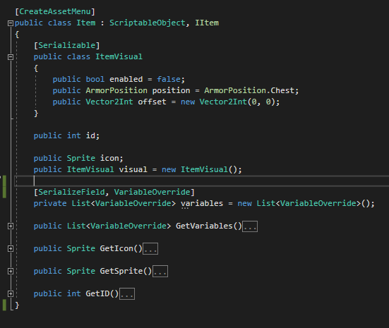

# Inventory Systems

## Table of Contents

- [Item Setup with Scriptable Objects](#item-setup-with-scriptable-objects)
- [Scriptable Object With Modular Effects/Behavior](#scriptable-object-with-modular-effectsbehavior)
- [If No Need For Varying Items](#if-no-need-for-varying-items)
- [If Need Varying Items](#if-need-varying-items)

## Item Setup with Scriptable Objects

If you want to make the invetory system with Scriptable Object, look at this system.

## Scriptable Object With Modular Effects/Behavior

This tip works regardless of the actual inventory system used. As long as it uses Scriptable Objects/some form of Item reference storage. It allow for items to be more modular (not need a new class for every specific item type).  

Make items have a List/Array of "Behaviors," which are identified by an ID (string/enum).  
When equipped, specific MonoBehavior/Components can search for them and see if they have the correct behavior to do a specific action.

Resources:

- [See this GIF showing the modular system in action](https://streamable.com/926i5)

## If No Need For Varying Items

If there is no need for items to change during runtime (durability, item health...), then use this system.

Best way to set this up is to have Scriptable Objects Item with ID database.  
Basically, each `Item` is a Scriptable Object created in Unity.  
The Inventory is a `List<string>` or `List<int>`, which means it does not directly hold the item but a reference to the ScriptableObject/Prefab.  
Then you have a `Database` which is a singleton/prefab with a `Dictionary` (in Inspector) which has references to those Scriptable Objects.  
Then when you need an item from inventory, (Add or Get) you just pass the ID and then fetch from `Database`.  

## If Need Varying Items

If there is a need for items to change during runtime (durability, item health...), then use this system.

Have two Item types:

- `ItemSO`: Scriptable Object version of the Item, used for modification/creation. This has all the normal values + initial/max durability (not current). (This can also be done in JSON or any other format).
- `Item`: A simple Object which is the one being manipulated at runtime. It also has values for current durability/health and other varying values...

The Inventory stores a `List<Item>` which allows for passing around of `Item`s with durability/varying values. Add/Get returns the actual `Item`.  
There is a `Database`, which is a singleton/prefab with a `Dictionary` (in Inspector) with references to `ItemSO`s and their string/int ID.  
Then when you want to CREATE a new Item, you call `Database`'s CreateItem method with a string/int ID. The Database will fetch all the values from the `ItemSO` and copy them to a new `Item` object which is returned.  
